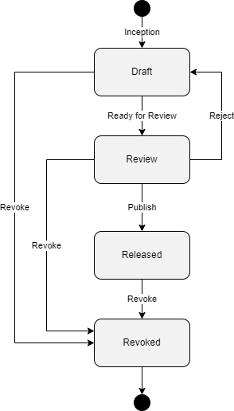

# Functional Profile Release Process

## Scope
This document structures the process for the life-cycle of functional profiles.

## States
A functional profile cycles through the following states:

| Action           | Description | Next State |
|------------------|-------------|------------|
| Inception        | A demand for a new functional profile materializes. The new functional profile is created in state "Draft" | Draft |
| Ready for Review | The functional profile has been developed and is ready for review by its relevant stakeholders | Review |
| Publish          | The functional profile has passed the review and is ready to be used. | Released |
| Revoke           | A functional profile has passed its usefulness and is not needed any more. Any state can be directly revoked. | Revoked |

## Creating New Functional Profiles

If the functional profile interest groups sees requirements for a new or improved functionality, it will create a new functional profile
XML with state "draft". A new issue will be created for this functional profile. The issue has 

- a self-evident description covering
  - context in which the need for this functional profile has arisen
  - purpose of this functional profile
- a label of the functional profile interest group concerned
- the project "Functional Profile Interest Group" assigned, with status "draft"

Any documentation, discussion and work on the elaboration of this functional profile will be tracked in this issue.

The team then works directly on the XML.

## Ready for review

When a new functional profile is considered ready it switches the state to review. The following criteria must be met for this step

1. Purpose and functionality of the functional profile is defined
2. level of operation is defined
3. Data points are defined, including mandatory/recommended/optional, units, type and read/write
4. Generic attributes for the functional profile and/or its data points are defined

## Publish

To publish a functional profile the following criteria must be met:

1. The version is set correctly according to the versioning scheme (see below)
2. All stakeholders concerned are happy with the content of the functional profile, and have given their formal consent
3. "SGr Deklarationsstelle" has been informed about the upcoming publish
4. The functional profile has been tested by at least one product.

Published functional profiles will not change anymore. If a change is requested, a new functional profile with increased version number will be created (see versioning scheme below). Therefore, only the release note structure of the functional profile can be updated on publishing.

## Revoke

If a functional profile shall not be used anymore it can be revoked. Only the note structure of the functional profile can be updated on publishing.

Revoked functional profiles are obsolete and shall not be used for further declarations of products and communicators. However, they will remain the data base for legacy reasons.

## Versioning Scheme

Functional profiles are numbered as follows: `Major.Minor.Build`

| Number | Description |
|--------|-------------|
| `Major` | Describes the major functionality family. Breaking changes implies an increment of the major number |
| `Minor` | Describes a backward compatible evolution. Only new functionality is added, but remaining functionality is never changed |
| `Build`  | The functionality remains identical, but minor non-functional details change, such as descriptions, translations, remarks |

